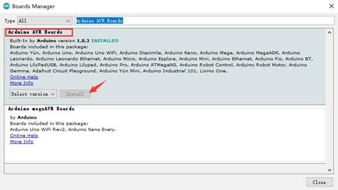
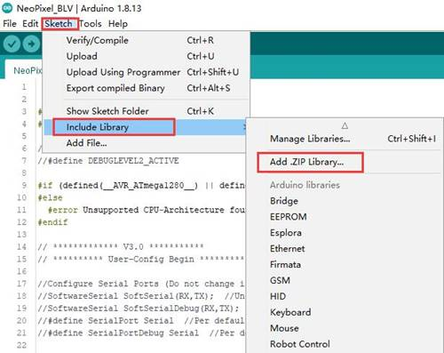
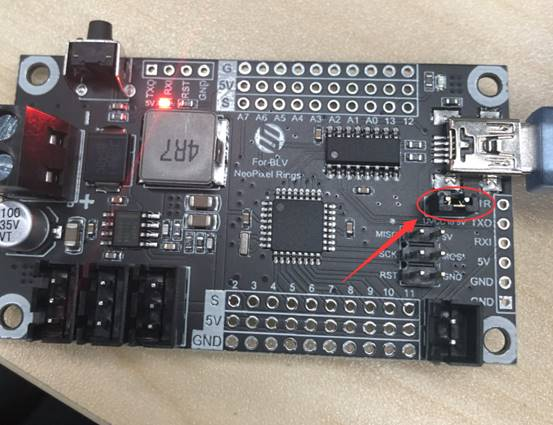
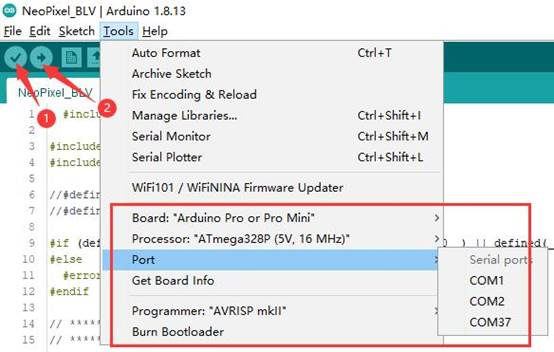

# RRF firmware

## RRF 2.x

The factory firmware version is RRF 2.x.`config2.x` folder contains RRF 2.x config for the BLV machine. Please copy `config 2.x` folder contents to your sdcard. And then insert sdcard to your machine.

## Upgrade to RRF 3.x

`config3.x` folder contains RRF 3.x firmware and its config for the machine. Follow the following steps to upgrage RRF from 2.x to 3.x.

- Copy `config 3.x` folder contents to your sdcard. 

- Insert sdcard to your machine.

- Send `M997 S0` command to upgrade the firmware version to 3.x

- Send `M115` command to check firmware version, it should be 3.x

# NeoPixel_Ring light

This folder contains arduino firmware `NeoPixel_BLV.ino` for NeoPixel_Ring light. You can follow the instructions below to compile and upload the firmware.

## step 1: Add a development board

If your Arduino IDE comes with Arduino AVR Boards by default, you can skip this step.

Tools->board:"xxx"->Boards Manager, search for `Arduino AVR Boards`, click `Install` to add the development board

## step 2: Add library

Add“Adafruit_NeoPixel-master.zip”（https://github.com/adafruit/Adafruit_NeoPixel）

## step 3: Upload firmware

As shown in the figure above, you need to plug in the jumper cap (unplug it when you finished uploading), plug in the USB, then open Arduino project [NeoPixel_BLV.ino](https://github.com/FYSETC/FYSETC-BLV-MGN-CUBE/blob/main/Firmware/NeoPixel_Ring light/NeoPixel_BLV.ino).

 

Select `Arduino Pro or Pro Mini` for development board;

The processor selects `Atmega328P (5V, 16MHz)`;

Choose the correct COM;

Click `1` to compile the firmware, and then click `2` to upload the firmware;

Wait for the firmware upload to complete.

# PanelDue

`PanelDue` folder contains firmware for our BLV machine PanelDue screen. You can use the USB cable to upload the firmware. Please refer [here](https://duet3d.dozuki.com/Wiki/PanelDue_Firmware_update).

